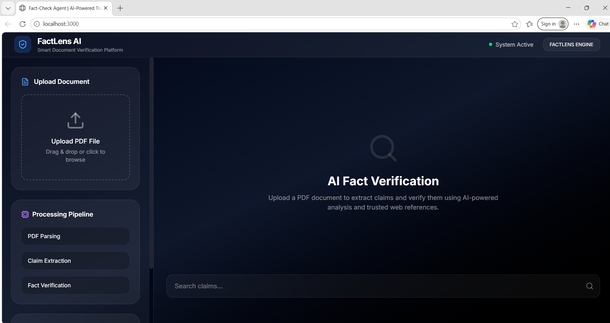
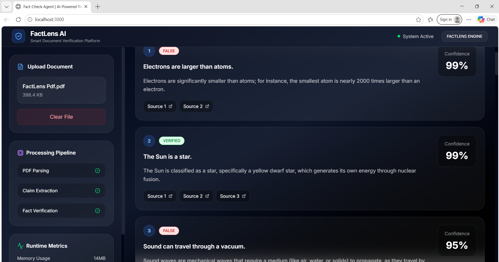

# FactLens AI

## Live Demo

[Live Demo](https://fact-lens-silk.vercel.app/)

<p align="center">
  
  
  
  
</p>

<p align="center">
  Intelligent document verification and claim analysis platform powered by AI-assisted reasoning and real-time web validation.
</p>

---

# Overview

FactLens AI is an AI-powered document verification platform designed to analyze PDF documents, extract factual claims, and validate them using intelligent web-assisted verification.

The system helps users identify:
- misleading information
- unsupported claims
- inaccurate statistics
- outdated facts
- conflicting evidence

Instead of manually validating long reports or articles, FactLens AI automates the entire verification workflow.

---

# Key Features

## Intelligent PDF Analysis
- Upload and process PDF documents
- Automatic text extraction
- Chunk-based document handling

---

## AI-Powered Claim Detection
- Detects factual and verifiable statements
- Supports scientific, financial, historical, and technical claims
- Filters non-verifiable content automatically

---

## Real-Time Verification
- Progressive live result streaming
- AI-assisted evidence analysis
- Web-based claim validation
- Confidence scoring system

---

## Search & Filtering
- Search extracted claims instantly
- Navigate large reports efficiently
- Interactive verification dashboard

---

## Verification Classification

| Status | Description |
|---|---|
| VERIFIED | Evidence strongly supports the claim |
| INACCURATE | Partial inconsistencies detected |
| FALSE | Evidence contradicts the claim |
| UNKNOWN | Insufficient data available |

---

# Screenshots

## Dashboard Interface



---

## Claim Verification Results



---

# Tech Stack

## Frontend
- React
- TypeScript
- Vite
- Tailwind CSS
- Framer Motion

---

## AI & Processing
- Gemini AI API
- AI-assisted claim extraction
- Structured JSON response parsing
- Progressive streaming architecture

---

## Document Handling
- PDF text extraction
- Chunk-based processing
- Batched verification system

---

# Project Architecture

```txt
FactLens/
│
├── screenshots/
│
├── src/
│   ├── lib/
│   │   └── documentParser.ts
│   │
│   ├── services/
│   │   └── aiEngine.ts
│   │
│   ├── models.ts
│   ├── App.tsx
│   └── main.tsx
│
├── index.html
├── package.json
├── tsconfig.json
├── vite.config.ts
└── README.md
```

---

# Installation

## Clone Repository

```bash
git clone https://github.com/Saumya-eng/FactLens.git
```

---

## Navigate to Project

```bash
cd FactLens
```

---

## Install Dependencies

```bash
npm install
```

---

# Environment Variables

Create a `.env` file in the root directory.

Example:

```env
VITE_GEMINI_API_KEY=your_api_key_here
```

---

# Start Development Server

```bash
npm run dev
```

The application will run locally at:

```txt
http://localhost:3000
```

---

# Build For Production

```bash
npm run build
```

---

# Verification Workflow

## Step 1 — Document Upload
Users upload PDF documents for analysis.

---

## Step 2 — Text Extraction
The system converts PDFs into structured raw text.

---

## Step 3 — Claim Detection
AI identifies factual and verifiable statements from document content.

---

## Step 4 — AI Verification
Claims are verified using web-assisted evidence analysis.

---

## Step 5 — Progressive Rendering
Results stream directly into the interface in real time.

---

# Performance Optimizations

FactLens AI includes:
- chunked PDF parsing
- incremental rendering
- batched AI verification
- duplicate filtering
- progressive streaming updates
- optimized UI rendering

---

# Current Limitations

- verification quality depends on publicly available information
- some topics may contain conflicting evidence
- scanned PDFs without OCR support may fail
- very large PDFs may increase response latency

---

# Future Enhancements

Planned improvements include:
- OCR support
- exportable verification reports
- multilingual verification
- source credibility ranking
- analytics dashboard
- authentication system
- cloud deployment integration

---

# Deployment

The platform can be deployed using:
- Vercel
- Netlify
- Render
- Railway

---

# Security Notes

Never expose API keys publicly.

Ensure the following remain excluded:

```txt
.env
node_modules/
dist/
```

---

# License

This project is intended for educational and research purposes.
